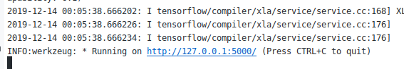
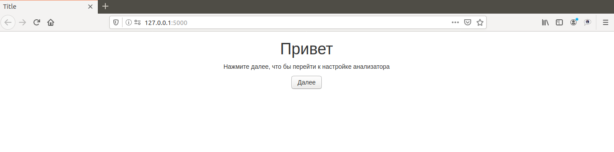
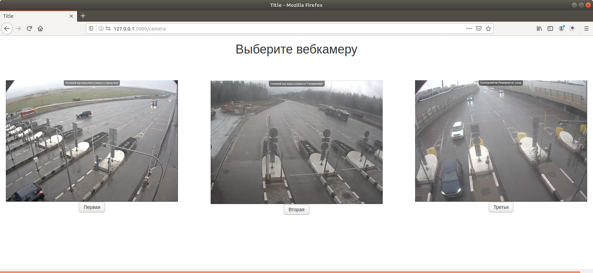
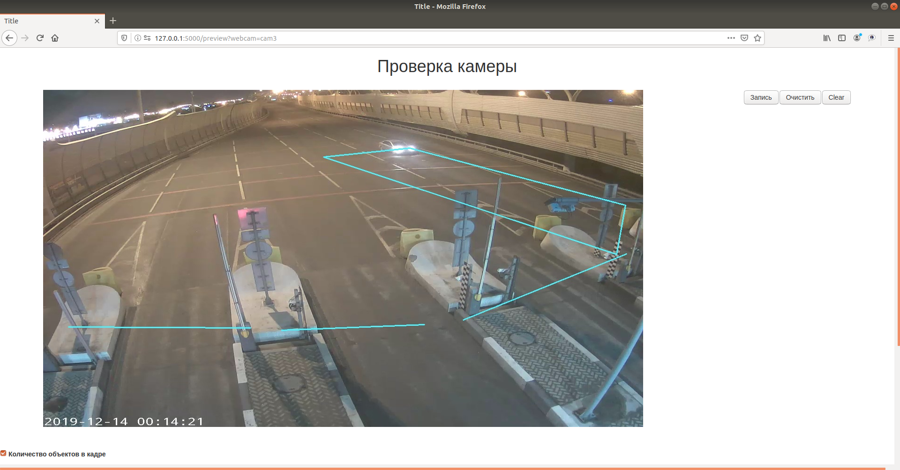
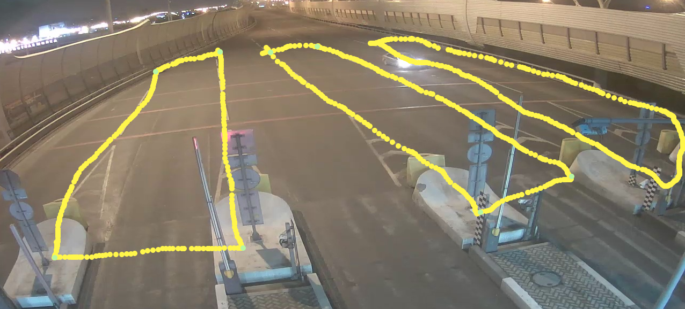
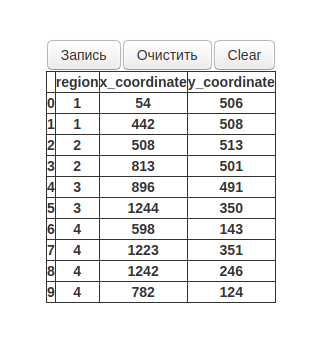
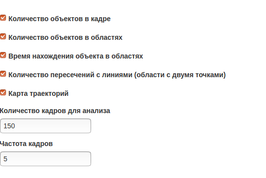
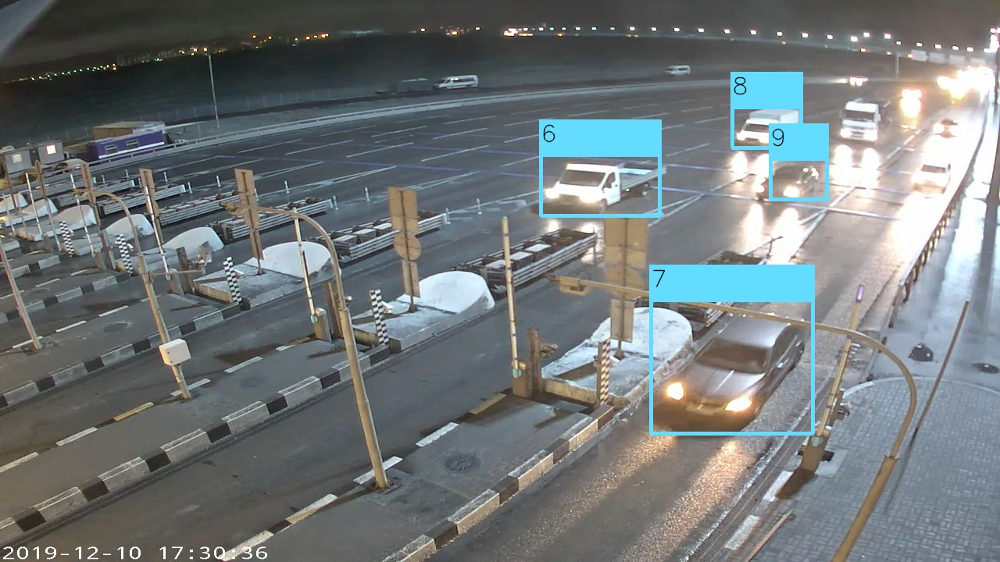
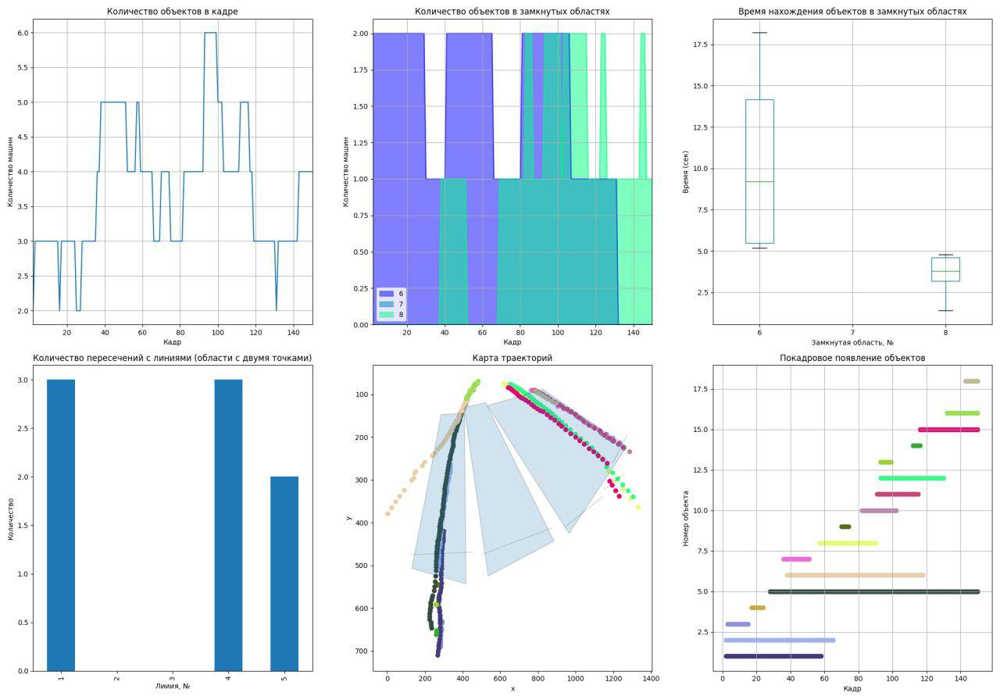

# Небольшой сайт для детектирования и трекинга автомобилей

### Введение 

В этом проекте происходит экспериментирование с автоматическим детектированием автомобилей с произвольно взятой (в теории) вебкамерой с сайта https://www.geocam.ru. Пользователь сам выбирает камеру и какую аналитику хочет посмотреть. Задает время анализа и может в любой момент остановить процесс.

### Ключевые моменты

* Сайт сделан на <a href = 'https://www.palletsprojects.com/p/flask'>flask</a>
* Детектирование происходит с помощью <a href = 'https://www.tensorflow.org'>tensorflow</a>
* Трекинг идет фильтром <a href ='https://ru.wikipedia.org/wiki/%D0%A4%D0%B8%D0%BB%D1%8C%D1%82%D1%80_%D0%9A%D0%B0%D0%BB%D0%BC%D0%B0%D0%BD%D0%B0'>Калмана</a>

### Описание работы

Запускаем сервер flask

Откроется приветственная страничка. 

На второй страничке предлагается выбрать одну из трех камер.В теории их может быть больше. Для демонстрации оставлены только три.

Нажимаем на кнопку внизу интересующей камеры и переходим к выбору показателей для анализа выбранной камеры. Условно, страницу можно поделить на три части. Большая часть занимает изображение текущего сосояния дорожного полотна. Справа будет таблица полигонов. Внизу выбор показателей для графики.
 

Если полигоны были заданы в прошлый раз использования программы, их очертания мы увидим на картинке вебкамеры. Удалить старые полигоны с картинки можно нажав на кнопке Clear справа.
На изображении с камеры можно рисовать. Зажав левую кнопку мыши и перемещая указатель можно рисовать желтым цветом. Щелкая два раза, получим голубую точку

Для очистки старых полигонов есть кнопка Очистить. Что бы записать новый полигон, нажмите кнопку Запись и щелкайте два раза по экрану. Для остановки записи снова нажмите на кнопку Записать.

Внизу страницы отмечаются показатели, которые будут отображаться при анализе камеры.

Есть следущие графики:
* Количество машин в кадре. Считаются все задетектированные машины.
* Количество машин внутри полигонов. Если полигон имеет более двух точек, то можно посчитать количество машин в каждой из областях. Областей может быть несколько. Также высчитывается время нахождения машин в каждой области. 
* Если полигон содержит только две точки, то можно посчитать сколько машин пересекло эту линию
* Траекторию машин.

Выбираем количество кадров для анализа. Учитываем, что частота кадров камер 5 кадров/с.

На следующей странице откроется две вкладки. на первой, раз в 30 сек будут отображаться графики показателей. На второй кадры с детектора
Частота обновления детектора - раз в сек.

